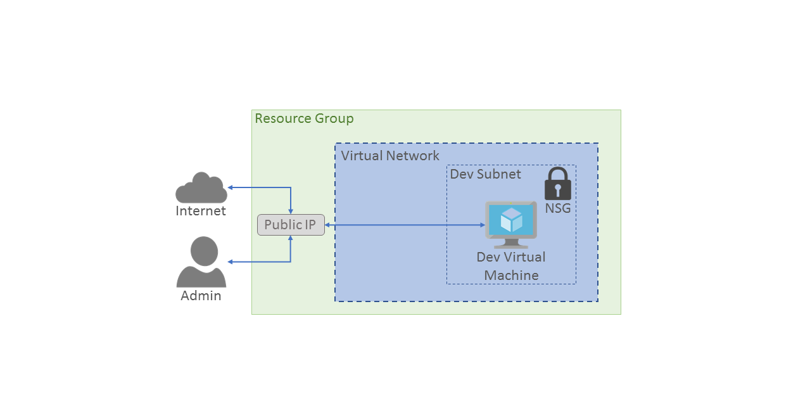
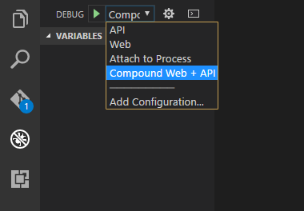

# Azure OpenDev Chapter 1 (Node.js): Deploying a Node.js app on Azure

## Session Overview
In this session you will run an application on your local computer, then deploy the application to a VM running in Microsoft Azure.

*Time to complete all of the exercises in this session: 30:00*

You can also view a [video version of this session].

## Session Objectives

* Introduce the City Power & Light sample application.
* Become familiar with the Azure Command Line Interface (CLI) 2.0. 
* Provision Azure resources using the Azure CLI.
* Deploy application code to a VM in an Azure Virtual Machines.

### Prerequisites

* [Node.js 7](https://nodejs.org/en/download/), which includes the Node package manager (npm).
* [Mongo Database](https://www.mongodb.com/download-center?jmp=nav#community), required to run the app on the local computer.
* An active Azure subscription. You can create a new Azure subscription for free in one of these ways: 
    * Use the [Azure free trial](https://azure.microsoft.com/pricing/free-trial/?WT.mc_id=A261C142F). Azure gives you credits to try out paid Azure services. Even when  the credits are gone, you can still keep the account and use some serviced for free, such as App Service Web Apps. Your credit card is never charged, unless you explicitly change your settings and ask to be charged.
    * You can [activate MSDN subscriber benefits](https://azure.microsoft.com/pricing/member-offers/msdn-benefits-details/?WT.mc_id=A261C142F). Your MSDN subscription gives you credits every month that you can use to paid for Azure services.
* Azure CLI 2.0. Follow the steps in the [Azure Command Line Interface (CLI) 2.0](https://docs.microsoft.com/en-us/cli/azure/get-started-with-azure-cli) topic to install the CLI.
* [Visual Studio Code](https://code.visualstudio.com/docs/setup/setup-overview), which is used for debugging the apps.
* On a local Windows computer, you will need to install a Git distribution and command-line tool, such as [Git for Windows](https://git-scm.com/download/win), which includes Bash. You will also need to [generate an SSH key](https://help.github.com/articles/generating-a-new-ssh-key-and-adding-it-to-the-ssh-agent/). Mac OS X and Linux already have Git enabled in the Terminal. 
* [MongoDB Community Edition](https://docs.mongodb.com/manual/administration/install-community/) installed locally and accessible to anonymous connections over the default port 27017. 

## Exercise 1: Introducing City Power & Light

City Power & Light (CP&L) is a simple web app that allows a user to create and view open *incidents*, which are outages or issues with a municipality's utilities. Existing open incidents are viewed in a dashboard. New incidents are created by filling out and submitting a form. The application is divided into a web tier based on Express.js, an API tier based on Loopback, and a data tier that uses MongoDB. The following diagram represents the architecture of the app running on a single VM:



To get started, you must download the sample to your local computer from the [GitHub repository](https://github.com/Azure/OpenDev). 

1. Open the Terminal (Bash on Windows) and run the following command that clones the repo to your local machine. 

	```bash
	git clone https://github.com/Azure/OpenDev.git
	```
	
Alternatively, download a zip file [here](https://github.com/Azure/OpenDev/archive/master.zip). 

1. Run the following command in both the `/node/web` and `/node/api` folders to restore  the package dependencies. 

	```bash
	npm install 
	```

1. In Visual Studio Code, open the `/node` folder. To start the app locally with [the debugger](https://code.visualstudio.com/docs/editor/node-debugging), select the Debug icon on the left navigation bar, select **Compound Web + API** configuration from the dropdown, and click the green start triangle. Allow access through the firewall if requested.

	

1. In the browser, navigate to <http://localhost:3000>.

	

 	On this page, you can click **Report Outage** to create a new incident. 

	>If your MongoDB instance was not configured to allow anonymous users to connect over port 27017 (the default), you must also update the **env** configuration object in the `/.vscode/launch.json` file with your MongoDB settings.

## Exercise 2: Provision Azure resources

Before you can deploy the application to Azure, you must provision a virtual machine in a resource group in your Azure subscription. A [resource group](https://docs.microsoft.com/en-us/azure/azure-resource-manager/resource-group-overview) lets you deploy, manage, scale, and delete sets of related resources in a consistent manner. Each Azure resource is assigned to a resource group, which is located in a specific [Azure Region](https://azure.microsoft.com/en-us/regions/). 

The following Azure CLI 2.0 commands create a new resource group named *CityPower* in the East US region, and then a new VM in that group. You may want to select a different region that is located geographically closer to you. If you decide to change the name of the resource group or of the VM, you will need to make this change in all of the subsequent scripts.

1. From the Terminal (Bash on Windows), run the following command to sign-in to your Azure subscription from the CLI, then follow the instructions to complete sign-in. 
	
	```bash
	az login
	```

2. Run the following command that creates the new resource group.

	```bash
	az group create -n CityPower -l EastUS
	```

2. Run the following command that creates a new VM named *CityPowerVM* in the new resource group. 

	```bash
	az vm create -g CityPower -n CityPowerVM --image UbuntuLTS
	```

	The provisioning process will take a few minutes. Make a note of the value of the `publicIpAddress` field in the output object. You will use this address to connect to the VM.

## Exercise 3: Migrate your app code the Azure

Now that your new VM is running in Azure, you need to migrate your app code so that it runs in the new VM. Because  the VM is a default Ubuntu image, you need to install a some additional applications in the VM. 

You can use the [SCP](https://en.wikipedia.org/wiki/Secure_copy) command to securely copy files from our local machines to the Azure VM. On Windows, you need to run SCP from a Bash command window. By default, the [Network Security Group (NSG)](https://docs.microsoft.com/azure/virtual-network/virtual-networks-nsg) closes all ports on the new VM, except for port 22. You must open port 80 to be able to copy code to the VM using SCP.

1. Delete the `node_modules` folders from both the `api` and `web` subdirectories. These folders take a long time to copy using SCP, and you will later reinstall them from the VM.

1. From the Terminal or a Bash console, run the following command to open a second port in the NSG. 
 
	```bash
	az vm open-port -g CityPower -n CityPowerVM --port 80 
	```

2. In the Terminal or a Bash console, navigate to the `/node` directory in the repository, and execute the following command that copies files in the working directory to the home directory of the VM.

	```bash
	scp -r . <yourPublicIpAddress>:~/ 
	```
 

    Note that you must replace the IP address placeholder `<yourPublicIpAddress>` with the public IP of your new VM. 

3. Use SSH to connect to the VM and verify the application files are present in the `/home` directory. 

	```bash
	ssh <yourPublicIpAddress>
	```

4. In the Azure VM, run the following command to download a setup script from the GitHub repository. 

	```bash
	curl -O https://raw.githubusercontent.com/Azure/OpenDev/master/setup/Extensions/node/SetupSingleVM.sh 
	```

6. Run the following commands to download the configuration file from the GitHub repository.

	```bash
	curl -O https://raw.githubusercontent.com/Azure/OpenDev/master/setup/Extensions/node/citypower.config.js
	```

5. Run the set up script in the VM.

	```bash
	sudo sh SetupSingleVM.sh
	```

	This script installs the following dependencies: [MongoDB](https://docs.mongodb.com/manual/administration/install-community), [Node.js 7](https://nodejs.org/en/download/), and [pm2](http://pm2.keymetrics.io/). It also moves application files from the **/home** directory to **/var/www** and uses pm2 to start the application.  

	At this point, your app should be up and running.

8. From the browser on your local computer, navigate to `http://<yourPublicIpAddress>` and verify that the City Power & Light application is running in Azure.

## Session Summary

In this session we took a multi-tier Node.js application running on a local developer machine, provisioned an Azure VM, and migrated the application to the cloud. 

## What's Next

Next, you will complete [Chapter 2][Session2Node]. In this next chapter, you will learn how to move data storage from your VM to dedicated Azure services to allow your data to be persisted outside of the VM. You will also use a Redis cache service to improve performance of the app.

## See Also

For more information about using Node.js with Microsoft Azure, see the following:
*[Azure Node.js Developer Center] 
*[Node.js Tools for Visual Studio]

For more information about using Node.js on Microsoft Azure, see the [Azure Node.js Developer Center].

<!-- URL List -->

[Node.js Tools for Visual Studio]: https://www.visualstudio.com/vs/node-js/
[Azure Node.js Developer Center]: https://azure.microsoft.com/develop/nodejs/

[Overview]: ./azurex-overview.md
[Session1Java]: ./azurex-session-1-java.md
[Session1Node]: ./azurex-session-1-nodejs.md
[Session2Java]: ./azurex-session-2-java.md
[Session2Node]: chapter-2a-leveraging-managed-mongodb-and-redis-services-for-your-node.js-app.md
[Session3]: azurex-session-3.md
[Session4]: azurex-session-4.md

<!-- IMG List -->
