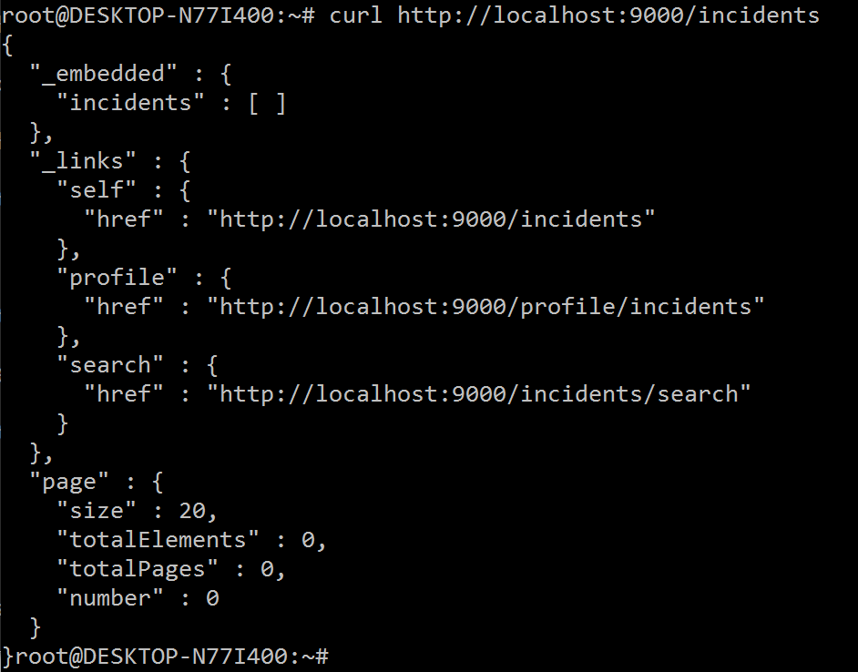

# Chapter 1 (Java): Deploying a Java Application on Azure

## Session Overview

In this session we look at our simple application for the Azure OpenDev, we install and run it on a local development machine, and then we move everything to run on an Azure virtual machine.

*Time to complete all of the exercises in this session: 00:00*

## Session Objectives

We will run our sample application on the local development machine, and then run the same application in Azure.  We will:

* Review the Azure OpenDev Java application, and install and run it on a local machine.
* Use the Azure command line interface to create a virtual machine in Azure
* Install our application on the Azure virtual machine

### Prerequisites

Before you complete the exercises in this session, you should read the information presented in the [Overview] article.

<!-- The following note would come from an include file when hosted on docs.microsoft.com -->
**NOTE**: You need an Azure account to complete the exercises in this session:

* You can [open an Azure account for free](https://azure.microsoft.com/pricing/free-trial/?WT.mc_id=A261C142F): You get credits you can use to try out paid Azure services, and even after they're used up you can keep the account and use free Azure services, such as Websites. Your credit card will never be charged, unless you explicitly change your settings and ask to be charged.
* You can [activate MSDN subscriber benefits](https://azure.microsoft.com/pricing/member-offers/msdn-benefits-details/?WT.mc_id=A261C142F): Your MSDN subscription gives you credits every month that you can use for paid Azure services.
* We have tested the exercises using Windows 10, MacOsX and Linux for the development platform, so any of those will be fine.  Of course you will have to adjust pathnames based on your platform.
* For the Java build tool we are using [Gradle](https://gradle.org/), which should also be installed before starting the exercises.
* You can use the IDE/Editor of your choice, but for these steps we are going to assume using [Eclipse Neon](http://www.eclipse.org/downloads/) which will work on all the popular platforms.  Please install your IDE before we start.  Also, we will need the [Gradle Buildship](https://projects.eclipse.org/projects/tools.buildship) plugin for Eclipse - please install that as well.
* We will use the [Mongo Database](https://www.mongodb.com/download-center?jmp=nav#community) on the local machine.  Install this before starting the Exercises as well.
* We use the [curl](http://curl.haxx.se) command line web request tool for testing the tiers of our application. Of course you can use whatever tool works for you, including a web browser.

## Exercise 1 - Creating your local application

1. The application code is maintained on Github in the [Azure/OpenDev repository](https://github.com/Azure/OpenDev).  To download all of the OpenDev artifacts to your local machine, you can either go to the GitHub URL and download as a zip file, or use any git tool to clone the repository (eg. `git clone https://github.com/Azure/OpenDev.git`).  I use a `c:\code` directory for all my projects, so I used the following steps to clone the repository:
    ```CMD
    cd \
    mkdir code
    cd code
    git clone https://github.com/Azure/OpenDev.git
    ```
1. The first java session code is stored in the `OpenDev/java/Session1` directory.  If you go there, you will see an `api` and `web` directory, containing the code for each tier of the application.
1. Make sure that mongo is running on your local machine.  If you don't have it started in a service, you may have to open up a command/terminal window and run `mongod` to run mongo (or on Windows, run `C:\Program Files\MongoDB\Server\3.4\bin\mongod.exe`).  To test whether mongo is running, you can use the curl command (which you may need to install).  This shows that mongo is not running:

    

    And this is my result after I start mongo:

    

1. To compile and start the api tier of the application, go to the `OpenDev/java/Session1/api` directory in a command prompt window, and run gradle with the bootRun task:
    ```CMD
    gradle bootRun
    ```
    Gradle will automatically retrieve the dependencies for the api application and will compile and start the api application.  You should see something like this:

    

    ***By default the API will be listening on port 9000 on the local machine.  

    To test that the API is working, use the curl program again (in a different window) with:
    ```CMD
    curl http://localhost:9000
    ```

    You should get something like this:

    

    You can also use the http://localhost:9000/incidents path to get all of the existing incidents in the database.  Since there are none yet, you should get something like this:

    

    There are several shell scripts in the OpenDev/java/Session1/api/utils directory that can create, update and query incidents using the api via the curl program.

    To stop the api tier, hit Control-C in the command window you are running it in. 

    To create an executable war file for the web tier application,  do `gradle assemble` at the command line. This will create a `OpenDev/java/Session1/api/build/libs/AzureX-API.war` file that can be run by executing `java -jar AzureX-API.war`. Do this now so you will have an executible artifact to upload to your Azure VM later.  Also, restart the api application.

1. Now we will move on to compiling and starting the web tier of the application.  The process will be much the same as running the api tier application.  Go to the 
OpenDev/java/Session1/web directory and run `gradle assemble`, which will create `openDev/java/Session1/web/build/libs/web.war` file, which is also an executible war file.  

    After you've done the build, you will have to set up two environment variables.  There is an IMAGE_STORAGE_LOCATION environment variable that points to a local directory that will hold incident images.  You can set this up (on Windows) by doing this:
    ```CMD
    mkdir c:\images
    set IMAGE_STORAGE_LOCATION=c:\images
    ```

    Also, the environment variable INCIDENT_API_URL should point to where the incident api is running, eg:
    ```CMD
    set INCIDENT_API_URL=http://localhost:9000
    ```

    After these environment variables are set, you can run the web tier of the application with:
    ```CMD
    cd OpenDev/java/Session1/web/build/libs
    java -jar web.war
    ```

    The default port that the web tier will listen on is 8080, so after the application is started, you should be able to go to a browser and browse to http://localhost:8080 and see this:

    
## Exercise 2 - Deploying your application to Azure

Lorem ipsum dolor sit amet, consectetur adipiscing elit, sed do eiusmod tempor incididunt ut labore et dolore magna aliqua.

## Exercise 3 - Verifying your application is running on Azure

Lorem ipsum dolor sit amet, consectetur adipiscing elit, sed do eiusmod tempor incididunt ut labore et dolore magna aliqua.

## Session Summary

Lorem ipsum dolor sit amet, consectetur adipiscing elit, sed do eiusmod tempor incididunt ut labore et dolore magna aliqua.

* Ut enim ad minim veniam, quis nostrud exercitation ullamco laboris nisi ut aliquip ex ea commodo consequat.
* Duis aute irure dolor in reprehenderit in voluptate velit esse cillum dolore eu fugiat nulla pariatur.
* Excepteur sint occaecat cupidatat non proident, sunt in culpa qui officia deserunt mollit anim id est laborum.

## What's Next

Once you have completed the exercises detailed in the above sections, your next step is to go through the exercises in [Session 2 (for Java Developers)][Session2Java].

## See Also

For more information about using Java with Microsoft Azure, see the [Azure Java Developer Center] and the [Java Tools for Visual Studio Team Services].

For more information about using Node.js on Microsoft Azure, see the [Azure Node.js Developer Center].

<!-- URL List -->

[Azure Java Developer Center]: https://azure.microsoft.com/develop/java/
[Java Tools for Visual Studio Team Services]: https://java.visualstudio.com/
[Azure Node.js Developer Center]: https://azure.microsoft.com/develop/nodejs/

[Overview]: ./README.md
[Chapter1Java]: ./chapter-1b-deploying-a-java-app-on-azure.md
[Chapter1Node]: ./chapter-1a-deploying-a-node.js-app-on-azure.md
[Chapter2Java]: ./chapter-2b-leveraging-managed-mongodb-and-redis-services-for-your-java-app.md
[Chapter2Node]: ./chapter-2a-leveraging-managed-mongodb-and-redis-services-for-your-node.js-app.md
[Chapter3]: ./chapter-3-transforming-from-a-single-vm-to-a-highly-scalable-geo-distributed-app.md
[Chapter4]: ./chapter-4-monitoring-your-azure-resources.md
[Chapter5]: ./chapter-5-automating-deployment-of-azure-resources-using-azure-resource-manager.md
[Chapter6]: ./chapter-6-managing-your-azure-resources-using-azure-cli.md
[Chapter7]: ./chapter-7-introduction-to-azure-container-service.md

<!-- IMG List -->
