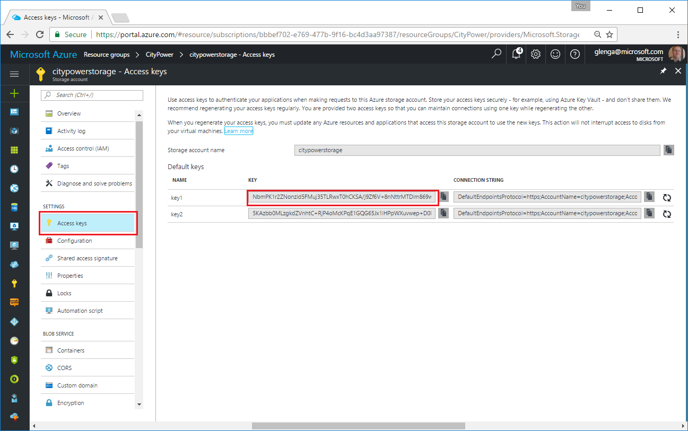

# Azure OpenDev Chapter 2 (Node.js) : Leveraging Managed MongoDB and Redis Services for Your Node.js Application

## Session Overview

In the [previous session][Chapter1Node] you learned how to "lift and shift" a multi-tier Node.js app from the local computer to run in an Azure VM. Now, you will learn how to use Azure services to optimize the application and better persist and cache data. 

*Time to complete all of the exercises in this session: 30:00*

You can also view a [video version of this session].

## Session Objectives

* Migrate the database tier of the app from MongoDB to DocumentDB.
* Use Azure Storage Service to store uploaded blobs.
* Add Redis Cache to decrease demand on backend resources.

After the session is complete, you will have updated the application architecture to the following:


### Prerequisites

Before you start the exercises in this session, you must first complete the prerequisites and steps in [Azure OpenDev Chapter 1: Deploying a Node.js app on Azure][Chapter1Node].

## Exercise 1: Migrate from MongoDB to DocumentDB

Having a database running on the VM makes scaling much more difficult, and data is lost when the VM state isn't maintained. Moving the database to its own tier decreasing the statefulness of the VM. By using a data tier hosted by Azure, you no longer have to setup, manage, maintain, and operate those machines.  The [Azure DocumentDB](https://azure.microsoft.com/en-us/services/documentdb/) service provides a hosted alternative for storing NOSQL data, and replacing MongoDB is simple because DocumentDB uses the MongoDB protocol. 

The following steps create a new DocumentDB and update the app configuration to use this new database for data storage. You will then sign in to the [Azure Portal] to get the connection string and authentication information for the new database. The cost of Azure DocumentDB depends on how much storage you use and the throughput of data requests. For pricing information, see the [DocumentDB pricing page](https://azure.microsoft.com/pricing/details/documentdb/).

1. From the Terminal (Bash on Windows), run the following command to sign-in to your Azure subscription from the CLI, then follow the instructions to complete sign-in.
 
	```bash
	az login
	``` 

2. Run the following command that creates the DocumentDB instance in your existing Resource Group.

	```bash
	az documentdb create -n city-power-db -g CityPower --kind MongoDB
	```

	Note that the *kind* parameter is used to make sure we get a database that uses the MongoDB protocol. Remember, if you used a different name for your Resource Group, you will need to change the command to instead use that name. 

3. Sign in to the [Azure Portal], click **Resource groups**, search for *CityPower*, then click **city-power-db**.

	

4. In **city-power-db**, click **Connection String** and copy down the connection string values. You will set these in the configuration file for the app. 

	

5. From the Terminal (Bash on Windows), use SSH to connect to the VM, navigate to the `/var/www` directory, open the `citypower.config.js` file using nano or another text editor and paste-in the following values from the portal.
	* `DB_HOST`
	* `DB_PORT`
	* `DB_USER`
	* `DB_PASSWORD`
	* `DB_DATABASE` should be set to `city-power-db`
	* `DB_SSL`: `true`
	* 
6. After you save the updated file, run the following command to restart the application.

	```bash
    sudo pm2 restart citypower.config.js 
	```

	The app is now using DocumentDB to store data. Note that by using a configuration file this migration to a hosted database was done only with configuration changes. The app code itself wasn't changed.

7. (Optional) Unless you configured MongoDB on your local computer, there won't be any existing data to migrate to Azure. However, if you did need to migrate data, there are third-party tools, such as [Studio 3T](https://studio3t.com/), [Robomongo](https://robomongo.org/), and others that can be used to export data from MongoDB into DocumentDB. 

## Exercise 2: Leverage Azure Storage

The City Power & Light app lets users upload a photo when a new incident is created. At this point, photos are stored on the local filesystem. Just as when using a local database, this negatively impacts scalability and data durability. The app supports the use of a distributed object storage system instead of the local fileystem for storing the image files. 

Next, you will create an [Azure Storage](https://azure.microsoft.com/en-us/services/storage/) account, which is perfect for storing messages, key-value pairs, and blob data, such as images or videos. The cost of Azure Storage depends on how much storage you use. For pricing information, see the [Storage pricing page](https://azure.microsoft.com/pricing/details/storage/blobs/). 

1. From the Terminal or a Bash console, run the following command that creates the Azure Storage account in your Resource Group.

	```bash
	az storage account create -n citypowerstorage -g CityPower -l eastus --sku Standard_LRS
	```

2. In the [Azure Portal], locate your **CityPower** resource group, click **citypowerstorage**, then click **Access Keys** and copy the value of **key1**. 

	

3. Connect to the VM again and this time update environment variables in the `citypower.config.js` file as follows:
	* `AZURE_STORAGE_ACCOUNT`: set to `citypowerstorage` 
	* `AZURE_STORAGE_ACCESS_KEY`: set to the value of **key1**

6. After you save the updated file, run the following command to restart the application.

	```bash
    sudo pm2 restart citypower.config.js 
	```

	The app is now using Azure Storage Blob service to store images outside of the VM. 

## Exercise 3: Use hosted Redis Cache to increasing performance 

With state removed from the app, it's time for other optimization, in this case caching. Currently, every time a user visits the web frontend, the API is hit with a request for page content. The API then queries the DocumentDB database (using the MongoDB protocol), and the data flows back to the original user. A large number of users can result in significant demand on the API and data tiers, even when the same information is being returned by separate requests. 

Adding a caching layer between the web and the API tiers decreases the load on the database. This results in faster page loading, and it also saves you money by using less [request units](https://docs.microsoft.com/azure/documentdb/documentdb-request-units). Azure offers [Azure Redis Cache](https://docs.microsoft.com/azure/redis-cache/cache-nodejs-get-started), a managed PaaS version of Redis. With a hosted Redis cache, Azure handles the platform and your app simply uses a connection string. 

Redis Cache is available in a variety of SKUs, with pricing dependent on tier and SKU. For detailed pricing information, see the [Redis Cache pricing page](https://azure.microsoft.com/en-us/pricing/details/cache/). 

The following steps create a 1 GB dedicated cache in the Standard tier, which is a production-ready cache with replication and failover. 

1. From the Terminal or a Bash console, run the following command that creates the Redis Cache instance in your Resource Group.

	```bash
	az redis create -n city-power-cache -g CityPower -l eastus --sku-name Standard --sku-family C --sku-capacity 1  
	```

2. In the [Azure Portal], locate your **CityPower** resource group, click **city-power-cache**, and copy the **Host name** value. 

3. In **Settings**, click **Properties** and copy the **SSL Port** value, then click **Access Keys** and copy the value of **key1**. 

	

4. Update environment variables in the `citypower.config.js` file again as follows:
	* `REDISCACHE_HOSTNAME`: set to **Host name** value 
	* `REDISCACHE_PRIMARY_KEY`: set to the value of **key1**
	* `REDISCACHE_SSLPORT`: set to the **SSL port** value

5. Restart the application again and load the dashboard screen. The returned values are cached for 30 seconds. You can verify this in the Console of the Azure Redis blade in the Azure Portal.


## Session Summary

In this session you took your original app and enhanced it with a series of Azure managed services. These services let you externalized state from your application to prepare for a more scalable solution going forward.

## What's Next

Now that you have completed these exercises, your next step is to complete the exercises in [Chapter 3][Chapter3]. In this next chapter, you will learn how to scale the app out info a highly-available, geo-distributed app.

## See Also

For more information about using Node.js on Microsoft Azure, see the [Azure Node.js Developer Center].

<!-- URL List -->

[Azure Portal]: http://portal.azure.com
[Azure Node.js Developer Center]: https://azure.microsoft.com/develop/nodejs/

[Overview]: README.md
[Chapter1Java]: chapter-1b-deploying-a-java-app-on-azure.md
[Chapter1Node]: chapter-1a-deploying-a-node.js-app-on-azure.md
[Chapter2Java]: chapter-2b-leveraging-managed-mongodb-and-redis-services-for-your-java-app.md
[Chapter2Node]: chapter-2a-leveraging-managed-mongodb-and-redis-services-for-your-node.js-app.md
[Chapter3]: chapter-3-transforming-from-a-single-vm-to-a-highly-scalable-geo-distributed-app.md
[Chapter4]: chapter-4-monitoring-your-azure-resources.md
[Chapter5]: chapter-5-automating-deployment-of-azure-resources-using-azure-resource-manager.md
[Chapter6]: chapter-6-managing-your-azure-resources-using-azure-cli.md
[Chapter7]: chapter-7-introduction-to-azure-container-service.md

<!-- IMG List -->
