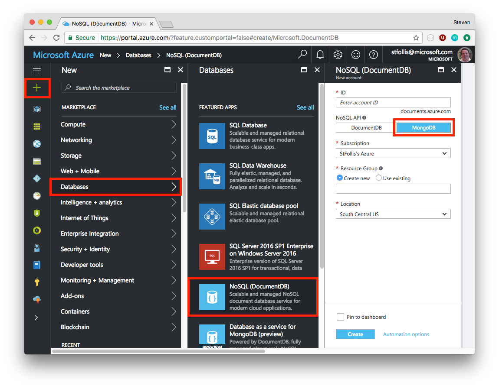
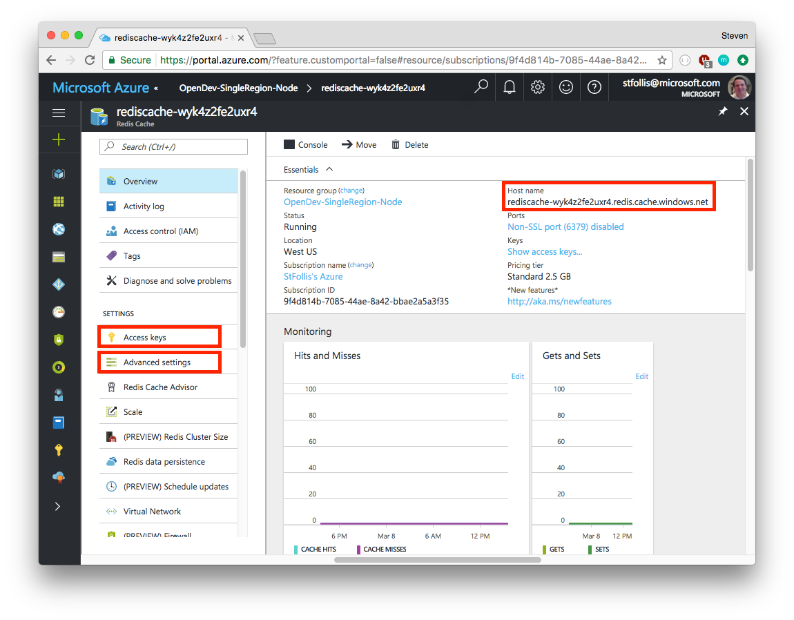
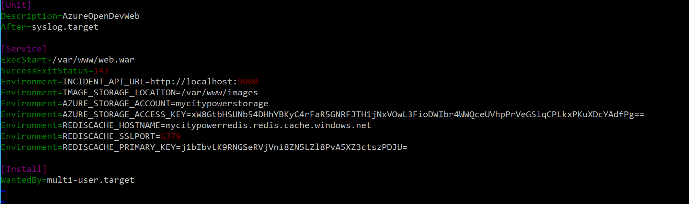
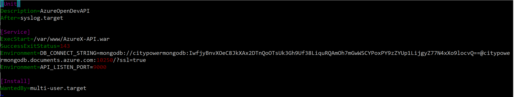

# Azure OpenDev Chapter 2 (Java) : Leveraging Managed MongoDB and Redis Services for Your Java Application

## Session Overview

In the previous session we lifted and shifted an application into an Azure Virtual Machine. Next, we will explore how we can optimize the application with managed Azure services. 

*Time to complete all of the exercises in this session: 30:00*

## Session Objectives

Throughout this session we move towards a stateless, high performance application.

* Understand how to migrate a database tier from MongoDB to DocumentDB.
* Demonstrate how Azure Storage Accounts can be positioned with blob files.
* Leverage caching to decrease demand on backend resources.

### Prerequisites

Before you complete the exercises in this session, you should read the information presented in the [Overview] article.

In order to complete the exercises in this session, you must first complete the prerequisites and steps outlined in [Session 1 (for Java Developers)][Session1Java].

## Exercise 1 - Migrating from MongoDB to DocumentDB

Having a database running directly on our virtual machine will make scaling much more difficult. Ideally, we should move the database into its own tier, decreasing the statefulness of our machine. If this tier was made up of one or more virtual machines, then we would still have to setup, manage, maintain, and operate those machines.  Instead, Azure offers a hosted service where the platform manages our data tier for us: [DocumentDB](https://azure.microsoft.com/en-us/services/documentdb/).

Converting our application to use DocumentDB is streamlined thanks to the service's ability to use the MongoDB protocol. From the [Azure Portal](http://portal.azure.com) click the green **"+"** icon in the top left corner. Then, select **Databases** and finally **NoSQL (DocumentDB)**. On the new account blade, give your database a name, resource group, and most importantly select **MongoDB** under the NoSQL API section.



Once the resource has finished provisioning, open the blade's settings and open `Connection String`. Copy the value for the `CONNECTION STRING` `citypower.config.js`.  Go back to your Azure VM and put that into the /etc/systemd/system/azurexapi.service:

    ```
    [Unit]
    Description=AzureOpenDevAPI
    After=syslog.target

    [Service]
    ExecStart=/var/www/AzureX-API.war
    SuccessExitStatus=143
    Environment=DB_CONNECT_STRING=<put your db connect string here>
    Environment=API_LISTEN_PORT=9000

    [Install]
    WantedBy=multi-user.target
    ```

We will restart the application after we update the code, and the web tier settings.

> Your stored data may need to also be moved. DocumentDB supports popular 3rd party tools such as [Studio 3T](https://studio3t.com/), [Robomongo](https://robomongo.org/), and others that enable export/import services. 

## Exercise 2 - Incorporating Azure Storage

City Power & Light supports a user uploading a photo whenever a new incident is created. This photo is currently being stored on the local filesystem, and similar to a local database negatively impacts scalability. We can move those image files out of a local fileystem and into a distribute object storage system. On Azure, this is an [Azure Storage Account](https://azure.microsoft.com/en-us/services/storage/). These accounts are terrific for holding blobs of data, such as images or videos.

1. Create an Azure Storage Account

1. Retrieve the storage account name and access key (key1)

1. Update environment variables in the virtual machine (in /etc/systemd/system/azurexweb) to include `AZURE_STORAGE_ACCOUNT` and `AZURE_STORAGE_ACCESS_KEY`

## Exercise 3 - Increasing performance through caching

With state removed from our application we can focus on other optimizations, such as caching. Currently, every time a user visits the web frontend, the API is hit with a request for page content. The API then queries the DocumentDB database (over the MongoDB protocol) and the data flows back to the original user. Many users can add siginificant demand onto the API and data tiers, which may be returning the very same information for a sequence of requests. 

Adding a caching layer between the web and the API tiers decreases the load on the database, loads pages quicker, and saves us money through less [request units](https://docs.microsoft.com/en-us/azure/documentdb/documentdb-request-units). Azure offers the [Azure Redis Cache](https://docs.microsoft.com/azure/redis-cache/cache-nodejs-get-started) in a variety of SKUs. This is a managed PaaS version of Redis, where Azure handles the platform and your app simply uses a connection string. 

1. Create an instance of Azure Redis. Be sure to unblock port 6379 because the Java code doesn't use an SSL connection to redis.

1. Retrieve values for host name, access key, and SSL port number (use port 6379).

1. Update environment variables in the virtual machine (in /etc/systemd/system/azurexweb.service) to include `REDISCACHE_HOSTNAME`, `REDISCACHE_SSLPORT` and `REDISCACHE_PRIMARY_KEY`



Your /etc/systemd/system/azurexweb.service should look like this (with your own values filled in):


and your /etc/systemd/system/azurexapi.service should look like this:


## Exercise 4 - Update code and restart application

1. We made some small changes to the code to leverage Azure storage and Azure Cache, while switching to the Azure DocumentDB database only required a connect string change.  The updated code is stored in the OpenDev/java/Session2 directory on your development machine.  
To compile and start the api tier of the application, go to the `OpenDev/java/Session1/api` directory in a command prompt window, and run gradle with the bootRun task:
    ```CMD
    gradle assemble
    ```
Similarly build the web tier war file by going to the `OpenDev/java/Session1/web`  directory and execute `gradle assemble`.

Use scp to copy the `api/build/libs/AzureX-API.war` and `web/build/libs/web.war` files to your VM home directory.  Then ssh to your VM and do the following commands to stage the executables and restart the application:
```CMD
    sudo cp AzureX-API.war /var/www
    sudo cp web.war /var/www
    sudo systemctl daemon-reload
    sudo systemctl restart azurexapi.service
    sudo systemctl restart azurexweb.service
```


## Session Summary

In this session we took our original app and enhanced it with a series of Azure managed services. These services allow us to focus on writing valuable application code, and spending less time on managing clusters of virtual machines. We also externalized state from our application, setting the stage for a more scalable solution going forward.

## What's Next

Once you have completed the exercises detailed in the above sections, your next step is to go through the exercises in [Session 3][Session3].

## See Also

For more information about using Java with Microsoft Azure, see the [Azure Java Developer Center] and the [Java Tools for Visual Studio Team Services].

For more information about using Node.js on Microsoft Azure, see the [Azure Node.js Developer Center].

<!-- URL List -->

[Azure Java Developer Center]: https://azure.microsoft.com/develop/java/
[Java Tools for Visual Studio Team Services]: https://java.visualstudio.com/
[Azure Node.js Developer Center]: https://azure.microsoft.com/develop/nodejs/

[Overview]: ./README.md
[Chapter1Java]: ./chapter-1b-deploying-a-java-app-on-azure.md
[Chapter1Node]: ./chapter-1a-deploying-a-node.js-app-on-azure.md
[Chapter2Java]: ./chapter-2b-leveraging-managed-mongodb-and-redis-services-for-your-java-app.md
[Chapter2Node]: ./chapter-2a-leveraging-managed-mongodb-and-redis-services-for-your-node.js-app.md
[Chapter3]: ./chapter-3-transforming-from-a-single-vm-to-a-highly-scalable-geo-distributed-app.md
[Chapter4]: ./chapter-4-monitoring-your-azure-resources.md
[Chapter5]: ./chapter-5-automating-deployment-of-azure-resources-using-azure-resource-manager.md
[Chapter6]: ./chapter-6-managing-your-azure-resources-using-azure-cli.md
[Chapter7]: ./chapter-7-introduction-to-azure-container-service.md

<!-- IMG List -->
