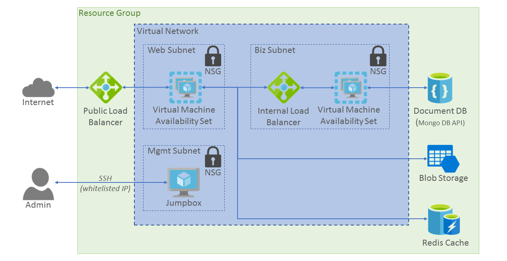

# Chapter 3 (Node.js):  Transforming from a Single Virtual Machine to a Highly-Scalable Geographically-Distributed Application

## Session Overview

In previous sessions you migrated an application to Azure and enhanced it and made it more stateless with a series of PaaS services. Up to this point you have worked with a single virtual machine. In this session you will horizontally scale that VM into multiple instances, multiple tiers, and multiple regions.

*Time to complete all of the exercises in this session: 20:00*

You can also view a [video version of this session].

## Session Objectives

* Learn how Azure Resource Manager (ARM) templates are used to deploy resources consistently and repeatedly.
* Scale virtual machine workloads on Azure with availability sets and virtual machine scale sets.
* Orchestrate multiple VM deployments with Jenkins.
* Demonstrate patterns for deploying solutions across multiple Azure regions.

## Prerequisites

In order to complete the exercises in this session, you must first complete the prerequisites and steps outlined in the following sessions: 

* Chapter 1: Deploying an app on Azure ([Node.js][Chapter1Node] | [Java][Chapter1Java])
* Chapter 2: Leveraging DocumentDB, Redis and Storage services in your app ([Node.js][Chapter2Node] | [Java][Chapter2Java])


## Exercise 1: Scale-out to a multi-instance architecture

When you complete this section, you will have a single-region, multi-instance distributed architecture for the app that looks like the following:



You will use predefined ARM templates to implement a scaled-out architecture using both [availability sets](https://docs.microsoft.com/azure/virtual-machines/virtual-machines-linux-infrastructure-availability-sets-guidelines?toc=%2fazure%2fvirtual-machines%2flinux%2ftoc.json) and [scale sets](https://docs.microsoft.com/azure/virtual-machine-scale-sets/virtual-machine-scale-sets-overview). 

You will create a subnet for both the Web and API tiers, and a "jumpbox" in a subnet as a "bastion host" to manage the app. For a complete discussion of this architecture, see the [video version of this session].

1. In the OpenDev repo, navigate to `\setup\ARMTemplates\Single-Region-ARM-Templates\deploymentParameters` and open the **virtualNetwork.Parameters.json** configuration file.

2. Replace the IP address in *mgmtSubnetNsgSourceAddressPrefix* with the IP address of your local computer. The ARM template will whitelist this IP address in the management subnet to allow SSH connections to the jumpbox.

3. In the Terminal or Bash console, run the following code to sign into the CLI.
 
	```bash
	az login
	```

4. Run one of the following commands to apply the ARM template, depending on your app type:

	* Node.js:
	 
		```bash
		..\setup\ARMTemplates\Single-Region-ARM-Templates\Deploy-AzureResourceGroup.sh --location westus --apptype Node
		```

 

## Exercise 2 - Deploy Code from Jenkins

1. Provision Azure Jenkins either from the [Azure Portal](http://portal.azure.com) Marketplace, or directly with an [ARM Template](http://aka.ms/azjenkins).  

1. Create Jenkins Projects to build each tier, then to release each tier into a set of VMs.

1. SSH into the virtual machine and install the [Azure CLI 2.0](https://docs.microsoft.com/en-us/cli/azure/get-started-with-azure-cli). 

1. Create a Service Principal and update the Jenkins Projects with the credentials

1. Update the environment variables within the Jenkins Project to match your deployed resources.

1. Deploy the code to the target VMs

## Exercise 3 - Geographic Redundancy

Lorem ipsum dolor sit amet, consectetur adipiscing elit, sed do eiusmod tempor incididunt ut labore et dolore magna aliqua.

* https://docs.microsoft.com/azure/guidance/guidance-resiliency-checklist

## Session Summary

In this session, you used ARM  

## What's Next

Now that you have completed these exercises, your next step is to complete the excersises in [Chapter 4][Chapter4]. In this next chapter, you'll configure monitoring for the Azure resources that support your app.

## See Also

* [Deploy and manage virtual machines by using ARM templates and the Azure CLI](https://docs.microsoft.com/azure/virtual-machines/virtual-machines-linux-cli-deploy-templates)

<!-- URL List -->

[Azure Java Developer Center]: https://azure.microsoft.com/develop/java/
[Java Tools for Visual Studio Team Services]: https://java.visualstudio.com/
[Azure Node.js Developer Center]: https://azure.microsoft.com/develop/nodejs/

[Overview]: README.md
[Chapter1Java]: chapter-1b-deploying-a-java-app-on-azure.md
[Chapter1Node]: chapter-1a-deploying-a-node.js-app-on-azure.md
[Chapter2Java]: chapter-2b-leveraging-managed-mongodb-and-redis-services-for-your-java-app.md
[Chapter2Node]: chapter-2a-leveraging-managed-mongodb-and-redis-services-for-your-node.js-app.md
[Chapter3]: chapter-3-transforming-from-a-single-vm-to-a-highly-scalable-geo-distributed-app.md
[Chapter4]: chapter-4-monitoring-your-azure-resources.md
[Chapter5]: chapter-5-automating-deployment-of-azure-resources-using-azure-resource-manager.md
[Chapter6]: chapter-6-managing-your-azure-resources-using-azure-cli.md
[Chapter7]: chapter-7-introduction-to-azure-container-service.md

<!-- IMG List -->
